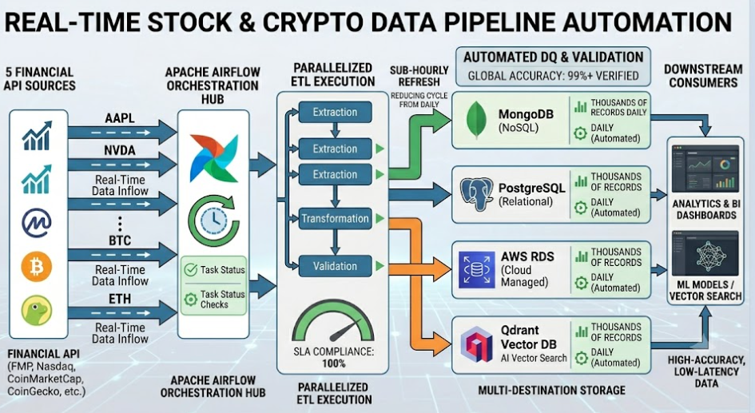

# Muhammad Arsalan — Portfolio

Personal portfolio website showcasing production data pipelines, analytics dashboards, web scraping systems, data extraction workflows, and Python automation projects.

**Live site:** [https://muhammad-arsalan-ai.github.io/portfolio/](https://muhammad-arsalan-ai.github.io/portfolio/)

---

## About

Muhammad Arsalan is a **Data Professional** with 3+ years of experience across:

- Data Engineering &amp; cloud pipelines
- Data Analytics &amp; BI dashboards
- Web Scraping &amp; data extraction
- Python automation workflows

Open to **on-site, hybrid, and remote** roles worldwide.

| | |
|---|---|
| **Email** | [marsalan8@outlook.com](mailto:marsalan8@outlook.com) |
| **Phone** | +92 324 678 3480 |
| **LinkedIn** | [muhammad-arsalan-ai](https://www.linkedin.com/in/muhammad-arsalan-ai/) |
| **GitHub** | [Muhammad-Arsalan-Ai](https://github.com/Muhammad-Arsalan-Ai) |

---

## Screenshots

### Hero &amp; profile


### Featured production pipeline (OfficeField)



### Power BI dashboard project


> **Tip:** After UI changes, capture full-page screenshots and add them to `assets/images/readme/` for richer README previews.

---

## Features

- **Responsive dark-theme UI** — desktop, tablet, and mobile
- **Project showcase** with category filters (Engineering, Analytics, Scraping, Automation)
- **9 featured projects** — production work, GitHub repos, and live demos
- **Role-specific resume downloads** — Data Engineer, Data Analyst, Web Scraping / Data Extraction
- **Skills section** — balanced across engineering, analytics, scraping, cloud, and automation
- **Experience timeline** — OfficeField, Upwork/Fiverr, Xloop Digital Services
- **Contact section** — email, phone, LinkedIn, GitHub
- **WhatsApp quick contact** — floating action button
- **SEO &amp; social sharing** — Open Graph, Twitter Card, canonical URL, favicon
- **Accessibility** — skip link, keyboard navigation, focus states, ARIA labels

---

## Tech Stack

| Layer | Technologies |
|-------|----------------|
| **Markup &amp; style** | HTML5, CSS3 (custom properties, Grid, Flexbox) |
| **Scripting** | Vanilla JavaScript (ES6+, no frameworks) |
| **Fonts** | Inter, JetBrains Mono, Dancing Script (Google Fonts) |
| **Hosting** | GitHub Pages |
| **Assets** | Local images + GitHub CDN for project previews |

**Domains covered in projects &amp; skills:** Python, SQL, Apache Airflow, PySpark, Kafka, AWS, Azure, PostgreSQL, MongoDB, Power BI, Scrapy, Selenium, Streamlit, Docker, and more.

---

## Featured Projects

| Project | Category | Link |
|---------|----------|------|
| Real-Time Stock &amp; Crypto Data Pipeline | Engineering · Production | Private case study — [contact](https://muhammad-arsalan-ai.github.io/portfolio/#contact) |
| AWS Real-Time Data Streaming | Engineering | [GitHub](https://github.com/Muhammad-Arsalan-Ai/AWS-Real-Time-Data-Streaming) |
| ETL Pipeline: Excel → MySQL &amp; PostgreSQL | Engineering · Automation | [GitHub](https://github.com/Muhammad-Arsalan-Ai/ETL-Pipeline--Excel-to-MySQL-and-PostgreSQL) |
| Counselor Recommendation System | Engineering | [GitHub](https://github.com/Muhammad-Arsalan-Ai/Capstone_Group_A) |
| Financial Dashboard — Power BI | Analytics | [GitHub](https://github.com/Muhammad-Arsalan-Ai/Financial-Dashboard-PowerBi) |
| Consumer Financial Complaints Dashboard | Analytics | [GitHub](https://github.com/Muhammad-Arsalan-Ai/Consumer-Financial-Complaints-Dashboard) · [Live Demo](https://appassignment-complains.streamlit.app/) |
| GovFinder Web Scraping | Scraping | [GitHub](https://github.com/Muhammad-Arsalan-Ai/GoV-Finder) |
| Tamimi Markets Product Scraper | Scraping · Extraction | [GitHub](https://github.com/Muhammad-Arsalan-Ai/Tamimi-Markets-Product-Scraper) |
| WOB Product Sitemap Scraper | Scraping | [GitHub](https://github.com/Muhammad-Arsalan-Ai/Wob-Scrapper) |

---

## Folder Structure

```
portfolio/
├── index.html              # Main page (all sections)
├── README.md               # This file
├── css/
│   └── styles.css          # Layout, theme, responsive styles
├── js/
│   └── main.js             # Nav, filters, scroll, back-to-top
└── assets/
    ├── images/
    │   ├── profile.jpg           # Profile photo & favicon
    │   └── stock-crypto-pipeline.png  # Pipeline architecture diagram
    └── resumes/
        ├── Muhammad_Arsalan_Data_Engineer.pdf
        ├── Muhammad_Arsalan_Data_Analyst.pdf
        └── Muhammad_Arsalan_Web_Scraping.pdf
```

---

## Local Development

No build step required. Preview locally with any static server:

```powershell
cd C:\Arsalan\Portfolio
python -m http.server 8080
```

Open [http://localhost:8080](http://localhost:8080) in your browser.

Stop the server with `Ctrl + C` in the terminal.

---

## Deployment (GitHub Pages)

1. Push this repository to GitHub (public repo recommended).
2. Go to **Settings → Pages**.
3. Under **Build and deployment**:
   - **Source:** Deploy from a branch
   - **Branch:** `main`
   - **Folder:** `/ (root)`
4. Enable **Enforce HTTPS**.
5. Wait 1–3 minutes for the build to complete.

**Live URL:** `https://muhammad-arsalan-ai.github.io/portfolio/`

### Before deploying, verify:

- [ ] `index.html` is at the **repository root**
- [ ] `assets/images/` and `assets/resumes/` are committed
- [ ] Resume PDF filenames match links in `index.html`
- [ ] Canonical and `og:url` in `index.html` match your Pages URL

---

## SEO Tags (in `index.html`)

The site includes the following in `<head>`:

| Tag | Purpose |
|-----|---------|
| `meta description` | Search engine summary |
| `meta author` | Author name |
| `link rel="canonical"` | Preferred URL |
| `link rel="icon"` / `apple-touch-icon` | Browser tab &amp; mobile icon |
| `og:title`, `og:description`, `og:url`, `og:image`, `og:type`, `og:site_name`, `og:locale` | LinkedIn / Facebook sharing |
| `twitter:card`, `twitter:title`, `twitter:description`, `twitter:image` | Twitter / X sharing |

All social image URLs use absolute paths on GitHub Pages:

`https://muhammad-arsalan-ai.github.io/portfolio/assets/images/profile.jpg`

---

## Resume Downloads

Three role-focused PDFs live in `assets/resumes/`:

1. **Data Engineer** — Airflow, PySpark, Kafka, AWS, ETL/ELT
2. **Data Analyst** — SQL, Power BI, Python, visualization
3. **Web Scraping / Data Extraction** — Scrapy, Selenium, BeautifulSoup

Replace the PDF files to update resumes without changing code.

---

## License

This portfolio source code and design are for personal use. Project code in linked GitHub repositories may have separate licenses.

---

**Built by Muhammad Arsalan** · [View live portfolio](https://muhammad-arsalan-ai.github.io/portfolio/)
